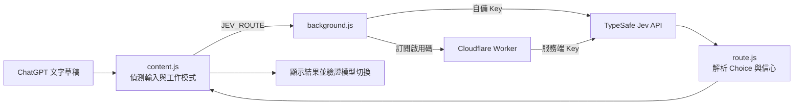

# JEV Model Router

在 ChatGPT 網頁輸入草稿時，用 [TypeSafe AI Jev](https://docs.typesafe.ai/introduction) 判斷適合的模型／推理強度，並嘗試在送出前切換。這是獨立開發的 Chrome／Edge Manifest V3 擴充功能，並非 OpenAI 或 TypeSafe AI 官方產品。

**目前狀態：** v0.2.7 原型。支援 `chatgpt.com` 的「對話」與「工作」文字輸入框；不讀取聊天歷史、附件或圖片，也不控制原生桌面 App。模型切換依賴 ChatGPT 網頁 DOM，網頁改版後需要重新驗證。

本 README 是維護者的入口。部署與手動驗收看 [安裝與部署](docs/SETUP.md)，資料流向看 [隱私說明](docs/PRIVACY.md)，狀態管理、路由與付款流程的細節看 [架構與維護指南](docs/ARCHITECTURE.md)。

## 快速開始

1. 取得專案，進入 `jev-model-router` 目錄。在 Chrome 開啟 `chrome://extensions`（Edge 為 `edge://extensions`），啟用開發人員模式，選「載入未封裝項目」，指向 [`extension/`](extension/)。
2. 點擴充功能圖示，選「自備 API Key」，填入 TypeSafe key 並儲存。這條路徑不需要 Worker、D1 或 Stripe。
3. 開啟 `https://chatgpt.com/`，輸入文字並停頓約 950 毫秒。輸入框右上方會顯示路由狀態與最多三個候選機率。
4. 修改擴充功能原始碼後，到 `chrome://extensions` 按「重新載入」，再重新整理 ChatGPT 頁面。詳盡驗收情境見 [SETUP.md](docs/SETUP.md)。

本擴充功能沒有前端建置步驟。若要修改程式，請先安裝 Node.js，並在專案根目錄執行：

```sh
npm run check
npm test
```

測試使用 Node 內建工具，未連線到真實 ChatGPT、TypeSafe、Cloudflare 或 Stripe；修改模型選單操作後，仍須在實際帳號中人工驗收。

## 運作方式



1. [`extension/content.js`](extension/content.js) 讀取目前輸入框的文字，區分「對話」或「工作」。輸入停頓約 950 毫秒後開始判斷；按送出時也會檢查當次草稿是否已處理。草稿的換行與縮排會保留。
2. [`extension/background.js`](extension/background.js) 依設定選擇直連 TypeSafe，或把 `{ text, surface }` 送到 Worker。兩條路徑共用 [`extension/route.js`](extension/route.js) 的請求格式與回應解析；Worker 也直接匯入該檔案。
3. `route.js` 向 Jev 提出一個 `Choice` 問題：先確保回答品質，品質相近時再選較快、較省的方案。對話模式有 `instant / medium / high / pro`；工作模式有 Luna、Sol、Astra 共六種模型與推理強度組合。
4. 回應包含選項、`probabilities` 和 `confidence`。`confidence < 0.45` 時只顯示建議、保留目前模型；其他情況嘗試操作 ChatGPT 選單。只有確認畫面上已選取目標模型與強度後，才顯示切換成功。

狀態燈：綠色代表已確認切換；黃色表示建議待確認、備用選項或部分切換；紅色表示無法確認切換。手動改選後，擴充功能不再干預當前模式的這份草稿。

## 專案地圖

| 路徑 | 維護重點 |
| --- | --- |
| [`extension/content.js`](extension/content.js) | 輸入框偵測、debounce、IME 保護、焦點還原、模型選單操作與狀態 UI。最容易受 ChatGPT DOM 改版影響。 |
| [`extension/route.js`](extension/route.js) | Jev `Choice` 指令、選項定義、回應驗證及前三候選。新增模型通常從這裡開始。 |
| [`extension/background.js`](extension/background.js) | API 路徑選擇、10 秒逾時、擴充功能與服務端通訊。 |
| [`extension/options.html`](extension/options.html)、[`options.js`](extension/options.js)、[`i18n.js`](extension/i18n.js) | 接入方式、金鑰／啟用碼設定、語系文字。 |
| [`worker/src/index.js`](worker/src/index.js)、[`stripe.js`](worker/src/stripe.js) | 訂閱路由、用量限制、Checkout、啟用、Portal 與 webhook。 |
| [`worker/schema.sql`](worker/schema.sql)、[`wrangler.jsonc`](worker/wrangler.jsonc) | D1 表結構、Worker 綁定、限制與排程；目前有部署佔位值。 |
| [`tests/`](tests/) | 路由、DOM 切換、語系、設定 UI、Worker 與 Stripe 的模擬測試。 |

## 常見修改入口

- **調整 Jev 判斷標準：** 修改 `buildJevRequest()` 的 `instructions` 與 `criteria`，並更新 `tests/route.test.js`。`confidence` 是選項分布的信心指標，不是「答對機率」。
- **新增 ChatGPT 模型：** 同步更新 `route.js` 的選項與說明、`content.js` 的模型／推理強度對應與選單辨識、UI 文案及測試。現有版本不會自動把網頁上新增的模型加入 Jev 候選。
- **ChatGPT 選單改版：** 優先檢查 `findComposer()`、`findModelButton()`、`selectModel()` 與 `selectWorkModel()`；不要僅憑點擊成功判定切換成功。測試需涵蓋選單關閉、模型名稱與推理強度確認。
- **訂閱或用量規則：** 修改 Worker 與對應測試，並同步更新 [SETUP.md](docs/SETUP.md) 的公開說明。金鑰與 D1 ID 不能提交到 Git。

## 已知邊界

- 使用者文字在停頓後就可能送往 TypeSafe；不必按 ChatGPT「送出」。自備 Key 時直接傳送；訂閱模式先經過你的 Worker。詳細資料處理見 [PRIVACY.md](docs/PRIVACY.md)。
- ChatGPT 沒有提供此擴充功能使用的官方模型切換介面。方案權限、語系與網頁改版都可能讓選單操作失敗；失敗時會提示手動調整。
- 模型建議是分類結果，尚未有真實使用資料的準確率基準。`npm test` 驗證的是程式行為，不代表 Jev 在所有任務上選對模型。
- 訂閱後端是可部署的原型，`worker/wrangler.jsonc` 仍含 D1／Stripe 佔位值；公開收費前需完成服務設定、真實付款驗收與正式政策文件。

本專案使用 [TypeSafe Choice API](https://docs.typesafe.ai/primitives/choice) 取得結構化決策。UI 參考 [shadcn/ui Base Alert](https://ui.shadcn.com/docs/components/base/alert) 的組合方式，以原生 DOM/CSS 實作，無需 React 或建置工具。
