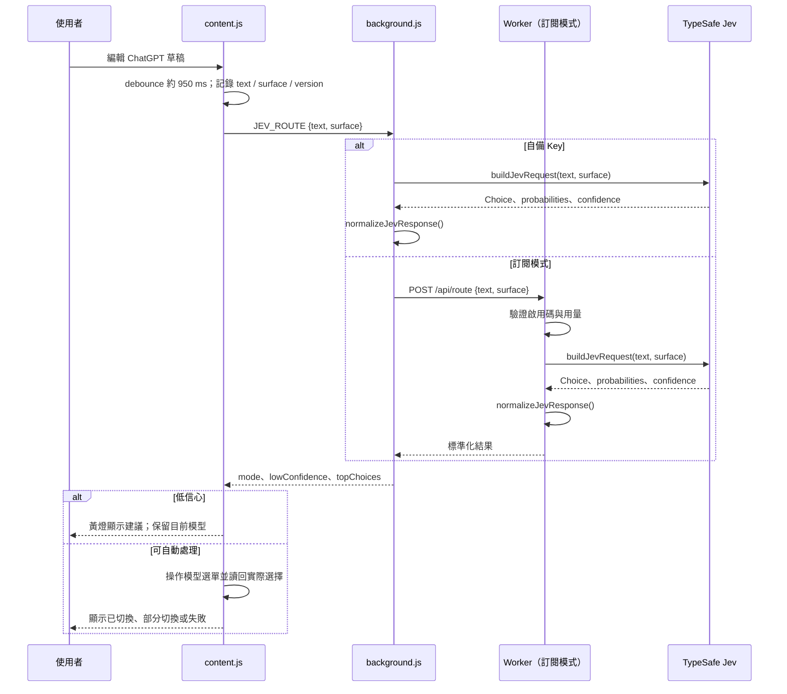

> 歷史文件：描述 0.2 自動切換／Stripe 原型。0.3 已改只推薦與 Skool；目前部署以 [CLOUDFLARE-SKOOL.md](CLOUDFLARE-SKOOL.md) 為準，勿執行本文件的旧付款部署流程。

# 架構與維護指南

此文件描述目前程式碼的實際行為，供維護 Chrome 擴充功能與可選訂閱服務的人使用。第一次接觸專案，先看 [README](../README.md) 的快速開始；部署步驟在 [SETUP.md](SETUP.md)。

## 系統邊界

擴充功能只在 `https://chatgpt.com/*` 執行。它讀取**目前可見的文字輸入框**，判斷使用者正處於「對話」或「工作」，再請 Jev 從程式預先定義的選項中選一個。它沒有 ChatGPT 帳號內部狀態、歷史訊息、附件內容，也沒有官方模型切換 API。

兩種接入方式的差別是誰持有 TypeSafe Key：

| 方式 | 路徑 | 金鑰與文字 |
| --- | --- | --- |
| 自備 Key | content script → background service worker → TypeSafe | Key 存在瀏覽器的 `chrome.storage.local`；草稿由瀏覽器直接送到 TypeSafe。 |
| 訂閱服務 | content script → background → Cloudflare Worker → TypeSafe | 瀏覽器送草稿與啟用碼到 Worker；TypeSafe Key 只在 Worker secret。Worker 用 D1 驗證訂閱與限制用量。 |

兩條路徑都使用 [`extension/route.js`](../extension/route.js) 的 `buildJevRequest()` 與 `normalizeJevResponse()`。[`worker/src/index.js`](../worker/src/index.js) 直接匯入這份共享程式碼；改動路由規則後，擴充功能需要重新載入，已部署的 Worker 也需要重新部署。

## 從輸入到切換

`readText()` 只移除首尾空白，保留草稿內部的換行與縮排。`onDraftChange()` 在文字或表面模式改變時遞增 `state.version`，取消尚未觸發的計時器並排程新判斷。`inDraft()` 檢查文字、版本及模式，避免較早的 API 回應覆蓋新版草稿。輪詢同時處理 ChatGPT 在不清空草稿時替換輸入框或切換「對話／工作」的情況。

## Jev 的決策格式

`buildJevRequest()` 傳送 `model: "jev-latest"`，把當前文字放在 `state.prompt`，並提出一個名為 `response_mode` 的 `choice` 問題。`instructions` 說明「先選足以可靠完成任務的方案，品質相近再考慮速度與資源」；`criteria` 定義每個可選模式的邊界。使用者文字是待分類資料，不應改寫路由規則。

| ChatGPT 表面 | Jev 選項 | 切換目標 |
| --- | --- | --- |
| 對話 | `instant`、`medium`、`high`、`pro` | ChatGPT 對話模式的相應選單項目或推理滑桿。 |
| 工作 | `luna`、`sol_low`、`sol_medium`、`astra_low`、`astra_medium`、`astra_xhigh` | 指定模型與 `low`／`medium`／`xhigh` 推理強度。 |

`normalizeJevResponse()` 驗證回傳選項和 `confidence`，從 `probabilities` 排序取最多三個候選。`probabilities` 用於顯示相對候選；`confidence` 用於程式是否自動切換的門檻。當 `confidence < 0.45`，`content.js` 顯示黃燈及建議，不操作選單，也不強制降至較弱模型。這個門檻是目前產品規則，若調整，應用真實案例比較誤切與漏切；模擬測試只能驗證程式有遵守規則。

## ChatGPT DOM 操作與使用者控制權

[`extension/content.js`](../extension/content.js) 先定位可見輸入框與附近的模型按鈕，再尋找可見的選單項目；工作模式另排除標記為停用的模型項目。對話模式可使用選單或推理滑桿；工作模式先選模型，再逐步調整滑桿。滑桿位置可能因帳號不同而變，因此程式每一步讀回實際值，最後同時確認**模型名稱與推理強度**。單純觸發 `.click()` 並不算成功。

為免干擾使用者：

- 中文等輸入法組字期間不路由；組字結束後重新判斷，且短時間內的 Enter 不會被當成送出。
- 使用者手動改選模型後，當前模式的這份草稿停止自動切換；切換「對話／工作」時會重新判斷。
- 自動切換前記錄輸入焦點與游標；切換後只在草稿仍相同、使用者未點到別處或按 Tab 時還原焦點。
- 按送出時，若草稿還未處理，`guardSend()` 先嘗試完成路由。低信心時仍可用目前模型送出；切換失敗則顯示手動調整提示。

上述保護依賴 ChatGPT 當下的 DOM 與事件行為。若網頁改版，先用真實帳號重現，再更新選擇器和驗證邏輯；不要把某次頁面上的 class name 當成穩定 API。

## 訂閱服務

[`worker/src/index.js`](../worker/src/index.js) 提供以下主要入口：

| 路徑 | 用途 |
| --- | --- |
| `GET /api/health` | 確認 Worker 可回應；不代表 TypeSafe、Stripe 或 D1 都已設定完成。 |
| `POST /api/route` | 驗證啟用碼、每日／每分鐘用量，呼叫 Jev，回傳標準化結果。 |
| `POST /api/checkout` | 建立 Stripe 訂閱 Checkout Session。 |
| `GET /activate` | 確認 Checkout 與訂閱狀態，產生啟用碼；再次開啟會換新碼。 |
| `POST /api/portal` | 用啟用碼開啟 Stripe Customer Portal。 |
| `POST /api/stripe-webhook` | 驗證 Stripe 簽章，再同步訂閱狀態。 |

啟用頁會將啟用碼明文顯示給使用者；之後瀏覽器以 Bearer token 傳給 Worker。D1 `licenses` 只儲存其 SHA-256 雜湊與訂閱狀態。`usage_windows` 儲存請求數和 Jev 輸入 token 數；不寫入草稿全文。Webhook 會查詢 Stripe 的目前訂閱狀態，避免僅依可能延遲的事件內容更新。Worker 每日排程清理七天前的使用量窗口。資料處理細節與正式上架前待辦見 [PRIVACY.md](PRIVACY.md)。

`worker/wrangler.jsonc` 的 D1 ID 與 Stripe Price ID 仍是佔位值。正式部署使用 Cloudflare secrets 設定 `TYPESAFE_API_KEY`、`STRIPE_SECRET_KEY`、`STRIPE_WEBHOOK_SECRET`；完整步驟見 [SETUP.md](SETUP.md)。

## 變更時的檢查順序

1. **路由規則或新模型：** 同時修改 `extension/route.js` 的 Jev 選項與 `extension/content.js` 的實際選單目標。更新 `tests/route.test.js`、`tests/content-selection.test.js` 及顯示文字；帳號未提供的選項要能明確失敗。
2. **ChatGPT 網頁改版：** 檢查 `findComposer()`、`inWorkMode()`、`findModelButton()`、`selectModel()`、`selectWorkModel()`。用不同語系、明暗主題、工作／對話模式和推理強度驗證。
3. **API 或訂閱變更：** 確認 `background.js` 與 Worker 兩條路徑輸出同樣的結果格式。改 D1 schema 或用量限制時，同步測試與部署文件。
4. **每次提交前：** 執行 `npm run check`、`npm test`，檢查 `.gitignore` 對 `.env`、`worker/.dev.vars` 的排除。UI、DOM 或付款變更還要依 [SETUP.md](SETUP.md) 做真實端對端驗收。

目前沒有可靠的自動化測試能保證 ChatGPT 頁面選單在所有方案上可操作，也沒有真實 Jev 判斷準確率基準。新增模型或調整提示詞前，應先收集代表性草稿與人工期望選項，才能判斷路由品質是否改善。
